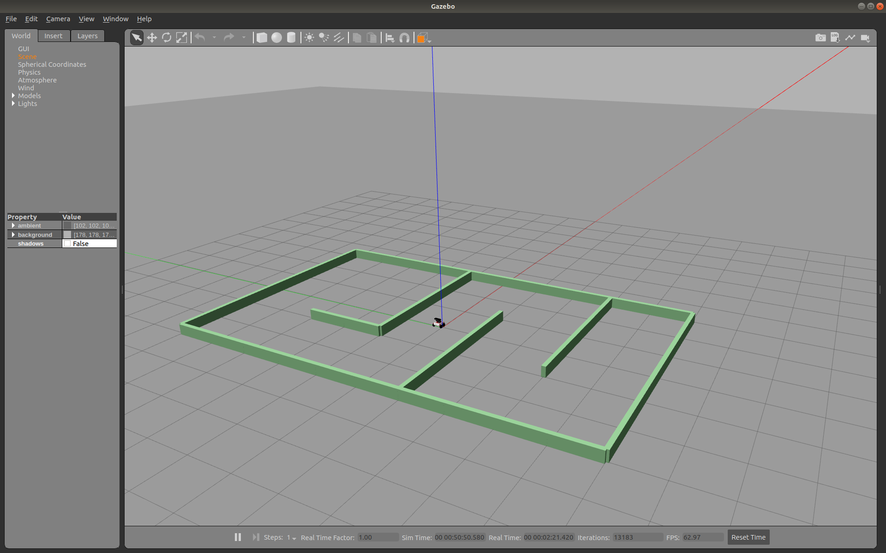
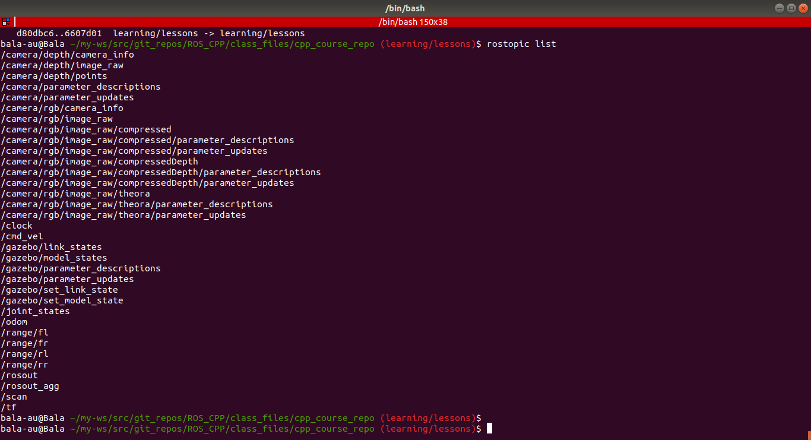
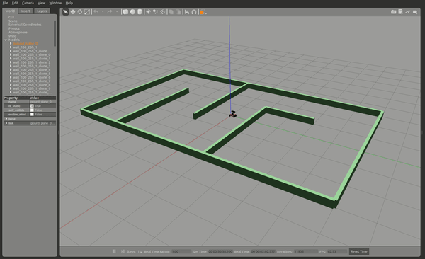

# ROS_CPP
Basics of using C++ with ROS. The files that are in this repository are created during my learning phase of coding ROS based executables with C++. The programming tasks are provided by the [**free course**](https://www.theconstructsim.com/robotigniteacademy_learnros/ros-courses-library/cpp-for-robotics/) offered by [**ROBOT IGNITE ACADEMY**](https://www.theconstructsim.com/).


## Course Contents:

* [*name.cpp*](./class_files/cpp_course_repo/c_scripts/src/unit1.cpp)  c++ code that prints "Hello World" to the console.
* [*unit1.cpp*](./class_files/cpp_course_repo/c_scripts/src/unit1_exercise.cpp) c++ code that makes the robot to move and prints the position of the robot in Gazebo
* [*unit1_exercise.cpp*](./class_files/cpp_course_repo/c_scripts/src/unit1_exercise.cpp) ros c++ code that takes the robot positions at two separate timestamps and calculates the velocity
in gazebo at two instants.
* [*unit2_exercise.cpp*](./class_files/cpp_course_repo/c_scripts/src/unit2_exercise.cpp)  code that retrieves full cartesian pose of the robot as list from odom and prints the position of the robot
* [*unit3_exercise.cpp*](./class_files/cpp_course_repo/c_scripts/src/unit3_exercise.cpp) separate function that makes the robot to move with series of velocity commands and returns the cartesian pose of the robot available through the odom topic 
* [*unit4_exercise.cpp*](./class_files/cpp_course_repo/c_scripts/src/unit4_exercise.cpp) ros node that receives all the laser readings at that timestamp and print it to the console with pointer to the first element of the laser readings
* [*unit5_exercise.cpp*](./class_files/cpp_course_repo/c_scripts/src/unit5_exercise.cpp) separate class that inherits from [rosbot_control](./class_files/cpp_course_repo/rosbot_control/src/rosbot_class.cpp) and moves the robot
* [*unit6_exercise.cpp*](./class_files/cpp_course_repo/c_scripts/src/unit6_exercise.cpp) mini project  of the course


## Execution 

The above cpp files will provide a ros executable node. But for the node to perform the function mentioned in the code the simulation of the robot has to be launched.To launch the simulation, run the following command in the terminal,

```sh
roslaunch rosbot_launch rosbot_launch.launch
```

On executing the above command in the terminal the following window opens. Gazebo environment with the robot and its simulation world.



The available topics from the robot can be seen in the terminal with the following command,
```sh
rostopic list
```


To execute any of the above mentioned "**__exercise.cpp**", make sure that the simulation is running and to execute the node provided by the "**__exercise.cpp**", run the following command in the terminal.

```sh
rosrun c_scripts unit3_exercise
```




